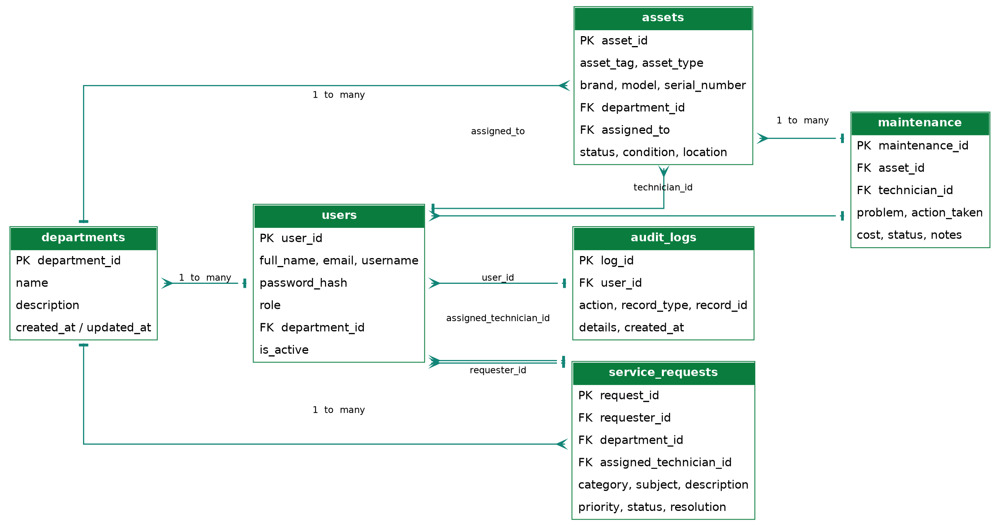
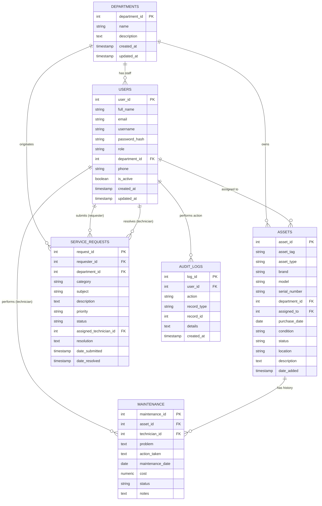

# Entity Relationship Diagram (ERD)

This diagram matches the actual PostgreSQL schema in `database/schema.sql` exactly —
it is not a separate conceptual diagram.

## Rendered Diagram



## Mermaid Source

The same diagram is also provided below as Mermaid source, in case you want to
regenerate it, embed it elsewhere, or view it interactively at
[mermaid.live](https://mermaid.live) or in VS Code with the "Markdown Preview
Mermaid Support" extension.



## Relationship summary (text form)

```
Departments 1 ──< Users
Departments 1 ──< Assets
Departments 1 ──< Service Requests

Users 1 ──< Assets            (assigned_to)
Users 1 ──< Service Requests  (requester_id)
Users 1 ──< Service Requests  (assigned_technician_id)
Users 1 ──< Maintenance       (technician_id)
Users 1 ──< Audit Logs        (user_id)

Assets 1 ──< Maintenance      (asset_id)
```

All foreign keys use `ON DELETE SET NULL` (for optional links, e.g. an asset whose
assigned staff member is removed) or `ON DELETE CASCADE` (for records that only make
sense attached to a parent, e.g. maintenance records belong to a specific asset).
See `database/schema.sql` for the exact constraint on each column.
