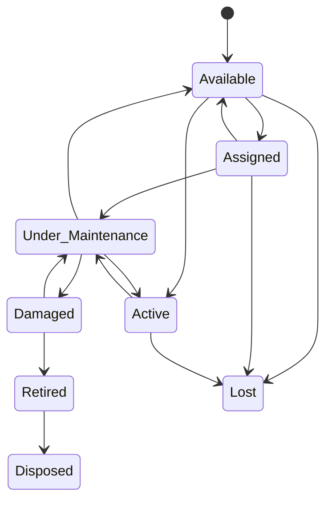

# Asset Lifecycle

## Current state

Confirmed current asset model:

- tracked in `assets`
- current assignment stored directly in `assigned_to`
- maintenance records tracked in `maintenance`
- hard delete supported for administrators

Current statuses confirmed in schema:

- `Active`
- `Available`
- `Assigned`
- `Under Maintenance`
- `Damaged`
- `Retired`

Current limitations:

- no assignment-history table
- no explicit return workflow
- no lost or disposed status
- no asset archival model
- no warranty fields
- no procurement metadata beyond purchase date

## Recommended target asset statuses

| Status | Meaning |
|---|---|
| Available | Ready for assignment |
| Assigned | Assigned to a user |
| Active | In departmental service but not directly user-assigned |
| Under Maintenance | In maintenance workflow |
| Damaged | Known damaged state pending repair or write-off |
| Retired | No longer in service but retained for record |
| Lost | Missing or unaccounted for |
| Disposed | Physically or contractually disposed |

## Valid transitions

| From | To | Allowed actors | Notes |
|---|---|---|---|
| Available | Assigned | ICT Officer, Administrator, proposed Asset Custodian | Requires assignee and department validation |
| Assigned | Available | ICT Officer, Administrator, proposed Asset Custodian | Requires return record |
| Assigned | Under Maintenance | Technician, ICT Officer, Administrator | Requires maintenance record |
| Active | Under Maintenance | Technician, ICT Officer, Administrator | Requires maintenance record |
| Under Maintenance | Active | Technician, ICT Officer, Administrator | After successful maintenance |
| Under Maintenance | Damaged | Technician, ICT Officer, Administrator | If repair not complete or not feasible |
| Damaged | Under Maintenance | Technician, ICT Officer, Administrator | Re-enter repair cycle |
| Damaged | Retired | ICT Officer, Administrator | Requires write-off reason |
| Retired | Disposed | Administrator, proposed Asset Custodian | Requires disposal approval |
| Any operational state | Lost | ICT Officer, Administrator | Requires incident record |

## Lifecycle rules

- Asset deletion should be replaced with archival except for controlled administrative purge.
- Assignment should create a history record instead of only overwriting `assigned_to`.
- Return should capture return date, returned condition, and receiving officer.
- Maintenance completion should not always force `Active`; it should consider whether the asset should return to `Assigned`, `Available`, or `Retired`.
- Department ownership and current physical location should be recorded separately.

## Recommended target asset fields

### Confirmed current fields

- `asset_id`
- `asset_tag`
- `asset_type`
- `brand`
- `model`
- `serial_number`
- `department_id`
- `assigned_to`
- `purchase_date`
- `condition`
- `status`
- `location`
- `description`
- `date_added`
- `created_at`
- `updated_at`

### Proposed additional fields

- `parent_asset_id` for bundled equipment if needed
- `assigned_department_id` if different from owning department
- `warranty_expiry_date`
- `vendor_name`
- `purchase_cost`
- `procurement_reference`
- `retired_at`
- `disposed_at`
- `disposal_method`
- `archive_reason`
- `is_archived`

## Proposed supporting tables

- `asset_assignments`
- `asset_status_history`
- `asset_documents` if attachment support is approved

## Recommended assignment rules

- Only one active assignment per asset at a time.
- The assigned user should belong to the assigned or owning department unless exception-approved.
- Assignment should capture assigning user, assignment date, expected return date if applicable, and notes.

## Recommended return rules

- Returned assets should move to `Available` unless maintenance or damage review is needed.
- Returned condition should be recorded.
- Returned assets should preserve the previous assignment history.

## Maintenance interaction

- Preventive and corrective maintenance should both be supported.
- Maintenance records should link to the asset and optionally to a related ticket.
- Asset lifecycle and maintenance lifecycle should not overwrite each other without history.

## Retirement and disposal

- Retirement should be a reversible administrative status until final disposal.
- Disposal should require approval, date, method, and responsible officer.
- Disposed assets should remain queryable in history and reports.

## Mermaid lifecycle diagram

## Current-to-target gaps

| Topic | Current | Target |
|---|---|---|
| Assignment history | Current assignee only | Full assignment table |
| Deletion | Hard delete | Archive-first |
| Status set | 6 statuses | 8 statuses |
| Procurement data | Minimal | Purchase and warranty fields |
| Linked tickets | None | Direct ticket linkage |
