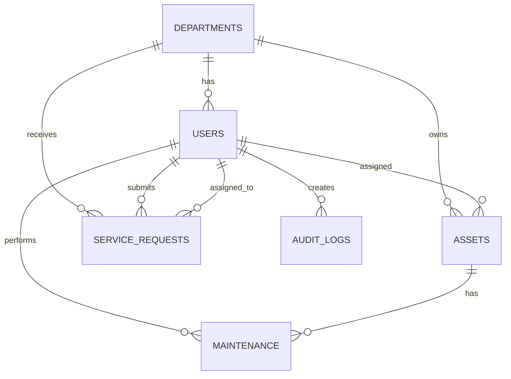
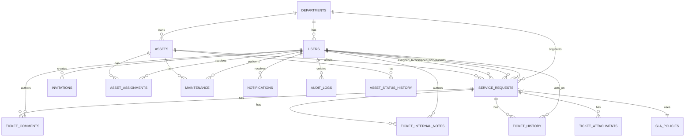

# Database Relationship Diagram

## Inspection summary

The current database schema is defined in [database/schema.sql](/C:/Users/DELL/Downloads/nsc-ict-system/database/schema.sql). No migration directory was found. The schema is a single bootstrap SQL script with seed data in [database/seed.sql](/C:/Users/DELL/Downloads/nsc-ict-system/database/seed.sql).

## Current schema

### Confirmed current tables

| Table | Purpose | Primary key | Key foreign keys | Notes |
|---|---|---|---|---|
| `departments` | Organizational departments | `department_id` | None | Unique name |
| `users` | System users and roles | `user_id` | `department_id -> departments.department_id` | No user type or supervisor |
| `assets` | Asset inventory | `asset_id` | `department_id -> departments.department_id`, `assigned_to -> users.user_id` | Current assignee only |
| `service_requests` | Tickets/service desk requests | `request_id` | `requester_id -> users.user_id`, `department_id -> departments.department_id`, `assigned_technician_id -> users.user_id` | Basic workflow only |
| `maintenance` | Asset maintenance records | `maintenance_id` | `asset_id -> assets.asset_id`, `technician_id -> users.user_id` | Not linked to service requests |
| `audit_logs` | Audit trail | `log_id` | `user_id -> users.user_id` | Free-text details |

### Current ER diagram

## Current table notes

### departments

- Important fields: `name`, `description`, timestamps
- Constraints: unique `name`
- Indexes: primary key only
- Delete behavior: other tables set department references to `NULL`

### users

- Important fields: `full_name`, `email`, `username`, `password_hash`, `role`, `is_active`
- Constraints: role check, unique email, unique username, case-insensitive unique indexes on lowercased email and username
- Indexes: role, department
- Missing target fields: `user_type`, `supervisor_user_id`, account dates

### assets

- Important fields: tag, type, serial, department, assigned user, condition, status, location
- Constraints: asset type check, condition check, status check, unique asset tag, unique serial number
- Indexes: status, type, department, assigned user
- Missing target fields: warranty, archive, disposal

### service_requests

- Important fields: requester, department, category, subject, description, priority, status, assigned technician, resolution
- Constraints: category, priority, and status checks
- Indexes: status, priority, category, technician, requester
- Missing target fields: ticket number, type, SLA, closure metadata

### maintenance

- Important fields: asset, technician, problem, action, date, cost, status
- Constraints: status check
- Indexes: asset, technician, status
- Missing target fields: maintenance type, next due date, related ticket

### audit_logs

- Important fields: user, action, record type, record id, details, created_at
- Constraints: none beyond foreign key
- Indexes: user, created_at
- Missing target fields: normalized event name, metadata payload, source IP if required

## Target schema

The target schema should preserve existing tables but expand them safely.

### Existing tables to retain and extend

- `departments`
- `users`
- `assets`
- `service_requests`
- `maintenance`
- `audit_logs`

### New proposed tables

| Table | Purpose |
|---|---|
| `invitations` | Temporary account invitation and approval tracking |
| `ticket_comments` | User-visible ticket conversation |
| `ticket_internal_notes` | ICT-only notes |
| `ticket_history` | Structured ticket event history |
| `ticket_attachments` | Ticket files if approved |
| `asset_assignments` | Historical assignment records |
| `asset_status_history` | Status transition history |
| `notifications` | In-app notification records |
| `notification_preferences` | User notification settings |
| `sla_policies` | Response and resolution targets |
| `knowledge_base_articles` | Optional self-service content |

## Target entity notes

| Entity | Purpose | Important fields | Constraints | Indexes | Delete/archive behavior |
|---|---|---|---|---|---|
| `users` | Account and identity | `user_type`, `role`, `department_id`, `supervisor_user_id`, account dates | valid user type and role | role, department, expiration | deactivate, do not delete |
| `departments` | Organization units | `name`, `is_archived` | unique active name | active status | archive instead of delete |
| `invitations` | Temporary-user onboarding | invitee, sponsor, role, department, expiry, status | expiry required, status check | email, status, expiry | retain history |
| `service_requests` | Tickets | `ticket_number`, `type`, `priority`, `status`, assignees, SLA | unique ticket number | status, priority, SLA due | retain indefinitely or archive per policy |
| `ticket_comments` | External conversation | author, body, visibility | non-empty body | request, author, created_at | retain |
| `ticket_history` | Structured events | event type, actor, from status, to status | required event type | request, created_at | retain |
| `ticket_attachments` | Files | storage key, filename, size | approved MIME types | request, uploaded_at | archive with ticket |
| `maintenance` | Maintenance records | asset, technician, type, status, cost | valid status and type | asset, technician, next due | retain |
| `assets` | Asset master | status, department, assignee, warranty, archive flags | unique asset tag | status, department, assignee | archive instead of delete |
| `asset_assignments` | Asset handover history | asset, assignee, assigned_by, dates | one active assignment | asset, assignee, active flag | retain |
| `notifications` | In-app alerts | recipient, type, read status, payload | valid type | recipient, read status, created_at | purge by retention policy |
| `sla_policies` | SLA definitions | ticket type, priority, response/resolution targets | active policy uniqueness | type, priority, active | retain history |
| `audit_logs` | Governance trail | actor, action, target, details | required action | actor, created_at, record type | retain |
| `knowledge_base_articles` | Support guidance | title, slug, body, status | unique slug | status, updated_at | archive |

## Proposed target ER diagram

## Migration-sensitive observations

- No current table stores temporary-account metadata.
- No current table stores historical asset assignment changes.
- No current table stores ticket event history.
- Current schema uses hard deletes and nullable foreign keys rather than archive flags.
