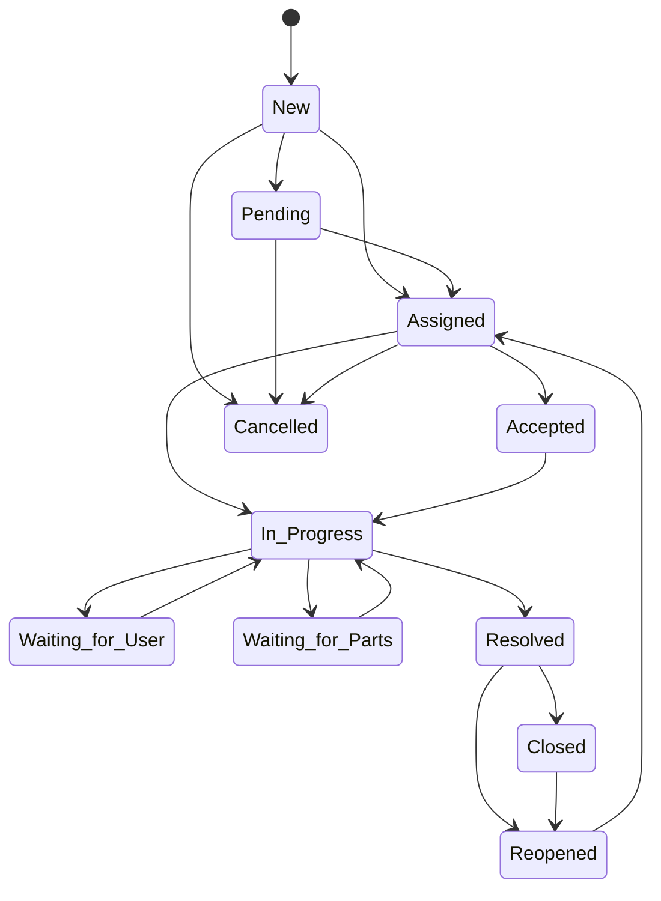

# Ticket Lifecycle

## Current state

Confirmed current ticket model in `service_requests`:

- categories: `Computer`, `Network`, `Printer`, `Internet`, `Software`, `Email`, `Hardware`, `Other`
- priorities: `Low`, `Medium`, `High`, `Critical`
- statuses: `Pending`, `Assigned`, `In Progress`, `Resolved`, `Closed`
- one assigned technician
- optional resolution text

Current limitations:

- no ticket type field
- no internal notes
- no comments table
- no attachments
- no reopen state
- no cancellation state
- no ticket history table
- no SLA tracking

## Recommended ticket types

These are proposed target ticket types.

| Type | Use case | Recommendation |
|---|---|---|
| Incident | Break/fix or outage affecting normal work | Adopt |
| Service Request | Standard service fulfillment such as setup or device request | Adopt |
| Access Request | Account access, reset, permission grant | Adopt |
| Maintenance Request | Planned or corrective asset servicing initiated as a ticket | Adopt |
| Change Request | Controlled change to systems or infrastructure | Adopt if organizational maturity supports approval flow |

## Recommended ticket statuses

| Status | Meaning |
|---|---|
| New | Created but not yet triaged |
| Pending | Logged and awaiting triage or assignment |
| Assigned | Assigned to an ICT officer or technician |
| Accepted | Assignee has acknowledged ownership |
| In Progress | Work has started |
| Waiting for User | Blocked pending requester response |
| Waiting for Parts | Blocked pending parts or procurement |
| Resolved | Technical work complete; awaiting closure |
| Closed | Ticket fully completed and closed |
| Reopened | Ticket was closed or resolved and then reopened |
| Cancelled | Ticket invalid, withdrawn, or duplicate |

## Valid status transitions

| From | To | Allowed actors | Required fields |
|---|---|---|---|
| New | Pending | ICT Officer, Administrator | triage note |
| New | Assigned | ICT Officer, Administrator | assignee |
| Pending | Assigned | ICT Officer, Administrator | assignee |
| Assigned | Accepted | Technician, ICT Officer | acceptance note optional |
| Assigned | In Progress | Technician, ICT Officer | work note |
| Accepted | In Progress | Technician, ICT Officer | work note |
| In Progress | Waiting for User | Technician, ICT Officer | blocker note |
| In Progress | Waiting for Parts | Technician, ICT Officer | blocker note |
| Waiting for User | In Progress | Technician, ICT Officer | follow-up note |
| Waiting for Parts | In Progress | Technician, ICT Officer | follow-up note |
| In Progress | Resolved | Technician, ICT Officer, Administrator | resolution |
| Resolved | Closed | ICT Officer, Administrator, Requester if policy allows | closure confirmation |
| Resolved | Reopened | Requester, ICT Officer, Administrator | reopen reason |
| Closed | Reopened | ICT Officer, Administrator, Requester if policy allows | reopen reason |
| New | Cancelled | ICT Officer, Administrator | cancellation reason |
| Pending | Cancelled | ICT Officer, Administrator | cancellation reason |
| Assigned | Cancelled | ICT Officer, Administrator | cancellation reason |

## Lifecycle rules

- Requester confirmation should be optional at implementation start but configurable by policy.
- A technician should not close a ticket unless policy explicitly allows it.
- Reopening should require a reason and create a ticket-history event.
- Cancellation should preserve the record; it should not delete the ticket.
- If a technician becomes inactive or changes department, open assigned tickets should move to an exception queue for ICT officer review.

## Proposed SLA targets

These values are proposed only and require organizational confirmation.

| Priority | Response target | Resolution target | Escalation threshold | Notification recipients |
|---|---|---|---|---|
| Critical | 15 minutes | 4 hours | 30 minutes without assignment | ICT Officer, ICT Manager, requester |
| High | 1 hour | 8 business hours | 2 hours without assignment | ICT Officer, requester |
| Medium | 4 business hours | 2 business days | 1 business day without progress | ICT Officer |
| Low | 1 business day | 5 business days | 2 business days without progress | ICT Officer |

## Recommended ticket fields

### Confirmed current fields

- `request_id`
- `requester_id`
- `department_id`
- `category`
- `subject`
- `description`
- `priority`
- `status`
- `assigned_technician_id`
- `resolution`
- `date_submitted`
- `date_resolved`
- `created_at`
- `updated_at`

### Proposed target fields

- `ticket_number`
- `ticket_type`
- `subcategory`
- `impact`
- `urgency`
- `affected_asset_id`
- `assigned_ict_officer_id`
- `status_changed_at`
- `sla_policy_id`
- `sla_response_due_at`
- `sla_resolution_due_at`
- `first_response_at`
- `closed_at`
- `closed_by_user_id`
- `closure_confirmation_required`
- `closure_confirmed_at`
- `reopen_reason`
- `cancel_reason`
- `source_channel`

## Proposed data-supporting tables

- `ticket_comments`
- `ticket_internal_notes`
- `ticket_history`
- `ticket_attachments`
- `sla_policies`

## Mermaid state diagram

## Current-to-target mapping

| Current status | Proposed target mapping |
|---|---|
| Pending | `New` or `Pending` depending on triage policy |
| Assigned | `Assigned` |
| In Progress | `In Progress` |
| Resolved | `Resolved` |
| Closed | `Closed` |

## Recommendation summary

- Preserve current simple flow for migration compatibility.
- Add new statuses in a controlled second phase.
- Introduce ticket history before enforcing advanced lifecycle transitions.
